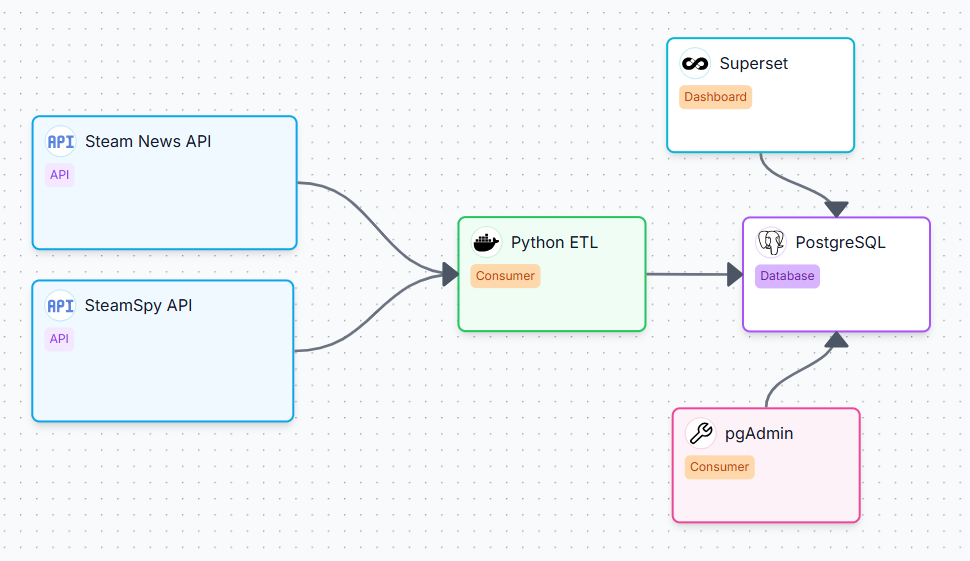

# Steam News & SteamSpy Data Warehouse

DWH-Projekt, das Steam News und SteamSpy vereinheitlicht (Postgres + optional Superset) und über ein Python-ETL befüllt wird.
Wichtig: Die Docker-Defaults sind bewusst einfach gehalten und nicht für produktiven Betrieb gedacht. Der Stack dient der lokalen Entwicklung, dem Lernen und der Visualisierung eines DWH.

## Schnellstart (Docker)

Es gibt zwei empfohlene Wege für den Einstieg:
- Empfohlen (reproduzierbar): ETL-Skripte ausführen und Daten selbst laden
- Optional (Demo/Visualisierung): SQL-Dump importieren, damit Dashboards sofort Daten anzeigen

Kurzbericht:
- [Kurzbericht](docs/kurzbericht.md)

Standarddienste (aus `.env.example`):
- PostgreSQL: `localhost:5432` (DB `dwh`, User/Pass `dwh`/`dwh`)
- pgAdmin: `http://localhost:5050` (admin@example.com/admin)
- Superset: `http://localhost:8088` (admin/admin)

### Hinweis zu Zeilenenden (LF statt CRLF)

Für Docker/Linux-Skripte müssen Zeilenenden im LF-Format vorliegen. CRLF kann dazu führen, dass Container-Entrypoints oder Shell-Skripte nicht starten.
Gerade unter Windows kann es passieren, dass Git oder die IDE (z. B. IntelliJ/PyCharm/VS Code) Dateien automatisch auf CRLF umstellt.
Das Repository erzwingt LF bereits über `.gitattributes`.
Falls lokal trotzdem Probleme auftreten, gibt es zwei Wege:

1. Bereits geklontes Repository global korrigieren:
```bash
git config core.autocrlf false
git add --renormalize .
```
2. Alternativ in der IDE/den Editor-Einstellungen das Zeilenende auf LF umstellen (ggf. pro Datei oder als Standard für das Projekt).

### Option A: ETL ausführen (empfohlen)
Dieser Weg ist unabhängig von externen Dumps und lädt eine begrenzte Datenmenge lokal.

1) Environment-Datei anlegen:

```bash
cp .env.example .env
```

2) Postgres + pgAdmin starten:

```bash
docker compose up -d
```

3) ETL ausführen (Docker):

```bash
docker compose --profile etl up --build etl
```
Hinweis: Der ETL ist bewusst so ausgelegt, dass er mit überschaubarem Datenumfang lauffähig ist und sich über Environment-Variablen skalieren lässt.

Optional: Superset starten:

```bash
docker compose --profile superset up -d --build superset
```

### Option B: SQL-Dump importieren (optional, für sofort gefüllte Dashboards)
Wenn Dashboards direkt Daten anzeigen sollen, kann alternativ ein Data-only SQL-Dump importiert werden.
Der Dump wird beim ersten Start automatisch geladen, wenn er im Verzeichnis dumps/ liegt.
Ein passender Dump (~180 MB) ist verfügbar unter:
- GitHub Release (empfohlen, stabil): Release-Assets des Repositories (Datei muss entpackt werden)
- Hessenbox (alternativ): https://next.hessenbox.de/index.php/s/abzGnaj43oW6fwd

Weitere Details zum Import siehe Abschnitt „Daten-Dump (Import)”.


## Architektur (Docker)

Der Stack besteht aus folgenden dockerisierten Komponenten:

- **postgres**: PostgreSQL-Datenbank (persistiert über Docker-Volume)
- **pgadmin**: Admin-UI für Postgres (optional, nur zur Entwicklung)
- **etl** (Profile `etl`): Python-ETL, das Steam News + SteamSpy lädt und ins DWH schreibt
- **superset** (Profile `superset`): BI-Frontend für Dashboards (optional)

Datenfluss:
Steam APIs → `etl` → `postgres` → (optional) `superset`




## Datenquellen

- Steam News API: Offizielle Steam API; News-Inhalte und Metadaten pro App/Spiel
- SteamSpy API: Inoffizielle Sammlung von abgeschätzten Statistik-Snapshots pro App (Owners, CCU, Reviews, Preise)

Hinweise:
- SteamSpy ist umfangreich; für das Projekt wird nur Seite 0 des `all`-Endpoints geladen (1000 relevantesten Spiele). 
- Beide Quellen liefern JSON und werden im Python-ETL (`scripts/`) verarbeitet.

## ERM

Das Schema ist ein Snowflake-Ansatz mit zwei Facts:
- `fact_news` (News-Ereignisse)
- `fact_steamspy_stats` (Snapshot-Metriken)


Anmerkung zum ERM:

Facts:
- `fact_news`: News-Ereignisse pro App und Zeit
- `fact_steamspy_stats`: Snapshot-Metriken pro App und Zeit

Dimensionen:
- `dim_app`: App-Stammdaten
- `dim_timestamp`: Zeitdimension (berechnete Date-Teile)
- `dim_update_typ`: Update-Tag-Klassifikation
- `dim_update_content`: News-Inhalte und Metadaten
- `dim_etl_run`: ETL-Run-Metadaten

Hinweis: `dim_update_content` referenziert `dim_app`, da `update_id` nur pro App eindeutig ist --> SteamSpy API liefert doppelte update_ids für verschiede Apps.

## ETL

Ein Initial-Run lädt die Basisdaten. Danach läuft der ETL inkrementell (neue Steam-News seit letztem Timestamp + neuer SteamSpy-Snapshot).

Ladeverhalten (Kurzfassung):
- `dim_app`: Insert/Update bei Änderungen
- `dim_timestamp`: Insert bei neuen Timestamps
- `dim_update_typ`: Insert bei neuen Tags
- `dim_update_content`: Insert-only
- `fact_news`: Insert-only
- `fact_steamspy_stats`: Insert-only pro Run

Docker (ETL-Container):
```bash
docker compose --profile etl up --build etl
```

Lokal:
```bash
pip install -r requirements.txt
python scripts/steam_etl_initial.py
```

## Daten-Dump (Import)

Wenn ein Data-only Dump in `dumps/` liegt, wird er beim ersten Start automatisch importiert.

1) Dump-Datei aus der Hessenbox in `dumps/` legen:

Hessenbox-Link:
https://next.hessenbox.de/index.php/s/HfNHxrwWEEHj7By

Wichtig: FÜr den Autoimport die `.dump`-Datei verwenden. Hierbei handelt es sich um eine komprimierte Data Only Datei für den Auto Import. Auto-Import mit Backup Datein (Data+Schema) führen vermutlich zu Datenbankkonflikten.
Einen vollständigen SQL Dump (DATA + SCHEMA) als SQL Format gibt es hier: https://next.hessenbox.de/index.php/s/9q3iPQyA8W9RnQi
2) In `.env` setzen:

```bash
POSTGRES_DUMP_FILE=/dumps/dwh_data.dump
POSTGRES_SMOKE_TEST=1
```

3) `docker compose up -d` starten.

Hinweis: Der Import läuft nur beim ersten Start mit leerem Volume. Der Smoke-Test wird danach automatisch ausgeführt; Details stehen in den Docker-Logs.

## Superset Dashboards (Import)

Wenn ZIP-Exporte in `imports/superset` liegen, können sie beim ersten Start automatisch importiert werden.
Details zu Auto-Import, manueller Einrichtung und den drei Dashboards stehen in:
- [Superset & Auswertung](docs/superset-auswertung.md)

## Data-only Dump erzeugen

Folgende Befehle können für das Erstellen eines Data-only Dump im Custom-Format verwendet werden:

```bash
docker compose exec -T postgres pg_dump -U dwh -d dwh --data-only --format=c -f /tmp/dwh_data.dump
docker compose cp postgres:/tmp/dwh_data.dump dumps/dwh_data.dump
```

## CI / Qualitätssicherung

Das Repository enthält eine GitHub Actions Pipeline (`.github/workflows/ci.yml`), die automatisierte Prüfungen auf zwei Ebenen durchführt.

### Validate

Der Job `validate` überprüft strukturelle und fachliche Korrektheit:

* Python-Syntaxprüfung (`compileall`)
* Shell-Skript-Syntaxprüfung
* Validierung der `docker-compose.yml`
* SQL-Validierung gegen eine frische PostgreSQL-Instanz
* Prüfung auf unerwünschte CRLF-Zeilenenden
* Existenzprüfung kritischer Projektdateien

Für die datenbankseitige Validierung wird ein deterministisches Minimal-Dataset geladen (`scripts/ci_fixture_minimal.sql`). Anschließend werden mit `scripts/ci_assertions.sql` zentrale Views und KPI-Berechnungen geprüft (z. B. Aggregationen, Deltas, Rolling News Counts).

Damit wird sichergestellt, dass:

* das Schema ausführbar ist,
* Views korrekt erstellt werden,
* zentrale Kennzahlen erwartete Ergebnisse liefern.

### Integration

Der Job `integration` führt einen Docker-Stack-Smoke-Test durch:

* Start von PostgreSQL im Compose-Stack
* Start von Apache Superset (inkl. Healthcheck)
* Import der bereitgestellten Dashboards
* Verifikation, dass Dashboards in der Superset-Metadatenbank registriert wurden
* automatisches Teardown des Stacks

Damit wird sichergestellt, dass:

* der Stack in einer sauberen Linux-Umgebung startet,
* Superset betriebsbereit ist,
* Dashboard-Imports technisch funktionieren.

### Ziel der CI

Die Pipeline stellt reproduzierbar sicher, dass:

* das Projekt in einer isolierten Umgebung build- und startfähig ist,
* Datenbanklogik konsistent bleibt,
* typische analytische Kennzahlen deterministisch geprüft werden,
* Dashboard-Exporte importierbar sind.

## Limitationen

- SteamSpy-Umfang ist auf Seite 0 des `all`-Endpoints begrenzt.
- Steam-News `update_id` ist nicht global eindeutig, daher Key auf (`app_id`, `update_id`).
- Facts sind append-only; keine Rückkorrekturen für gelöschte oder geänderte Quelldaten.
- Keine ausgeprägte Data-Quality-Schicht außer Basis-Constraints.
- Join zwischen `dim_update_content` und `dim_app` erhöht Join-Aufwand.

## Dokumentation
Für eine detailliertere Dokumentation bitte folgende Dateien betrachten:

- API Mappings auf DWH Schema: [Steam News Mapping](docs/mapping-steam-news.md), [SteamSpy API Mapping](docs/mapping-steamspy.md)
- Dokumentation ETL Prozess: [ETL Prozess](docs/etl.md)
- Dokumentation ENV Variablen & Systemkonfiguration: [Konfiguration](docs/configuration.md)

- Superset Setup + Dashboards + Auswertung: [Superset & Auswertung](docs/superset-auswertung.md)


## Repository-Struktur

- `docker/`: Postgres, ETL, Superset Container
- `scripts/`: Python-ETL
- `docs/`: Bericht, Mappings, Diagramme
- `.github/workflows`: CI Pipeline für Github
- `dumps/`: optionale DB-Dumps
- `imports/`: optionale Superset-Dashboards

## Lizenz

MIT. Siehe `LICENSE`.
