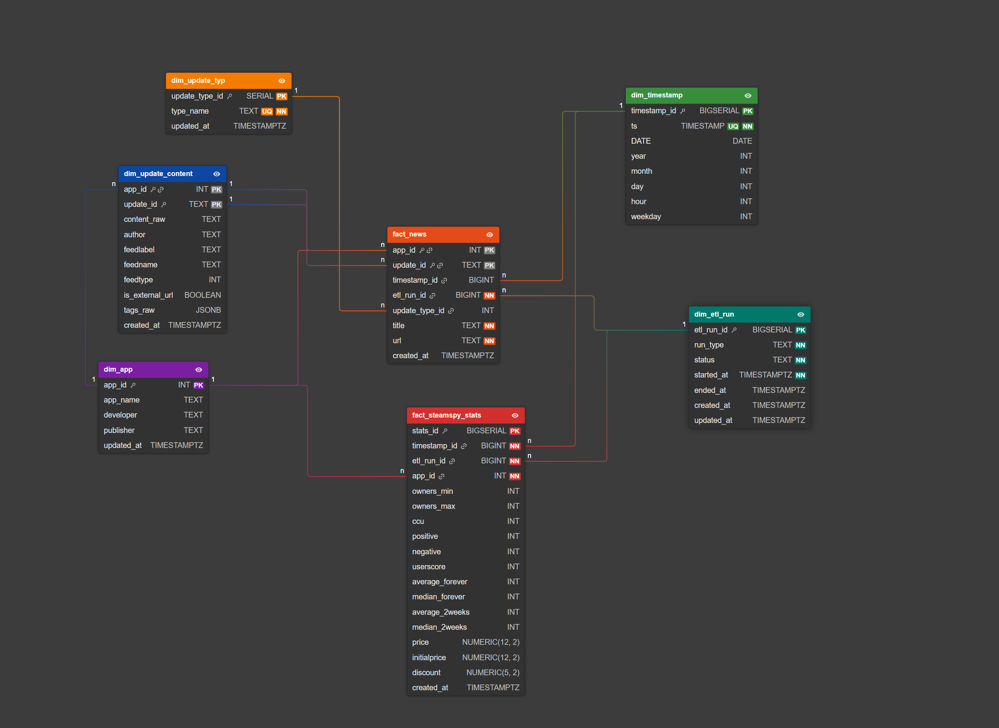

# Steam News & SteamSpy Data Warehouse

DWH-Projekt, das Steam News und SteamSpy vereinheitlicht (Postgres + optional Superset) und über ein Python-ETL befüllt wird.

Wichtig: Die Docker-Defaults sind bewusst einfach gehalten und nicht für produktiven Betrieb gedacht. Der Stack dient der lokalen Entwicklung, dem Lernen und der Visualisierung eines DWH.

## Schnellstart (Docker)

Für einen Schnellstart ohne vorherigen ETL Prozess kann ein SQL-Dump importiert werden. Dieser muss lediglich in `dumps/` liegen. Und wird beim ersten Start des Containers automatisch importiert.
Ein passender Dump befindet sich hier: Hessenbox-Link - https://next.hessenbox.de/index.php/s/abzGnaj43oW6fwd
Für weitere Informationen bezüglich Import und Export von Daten siehe die Abschnitt "Daten-Dump (Import)" "Data-only Dump erzeugen".

1) Environment-Datei anlegen:

```bash
cp .env.example .env
```

2) Postgres + pgAdmin starten:

```bash
docker compose up -d
```

Optional: Superset starten:

```bash
docker compose --profile superset up -d superset
```

Standarddienste (aus `.env.example`):
- PostgreSQL: `localhost:5432` (DB `dwh`, User/Pass `dwh`/`dwh`)
- pgAdmin: `http://localhost:5050` (admin@example.com/admin)
- Superset: `http://localhost:8088` (admin/admin)

## Datenquellen (kurz)

- Steam News API: Offizielle Steam API; News-Inhalte und Metadaten pro App/Spiel
- SteamSpy API: Inoffizielle Sammlung von abgeschätzten Statistik-Snapshots pro App (Owners, CCU, Reviews, Preise)

Hinweise:
- SteamSpy ist umfangreich; für das Projekt wird nur Seite 0 des `all`-Endpoints geladen (1000 relevantesten Spiele). 
- Beide Quellen liefern JSON und werden im Python-ETL (`scripts/`) verarbeitet.

## ERM

Das Schema ist ein Snowflake-Ansatz mit zwei Facts:
- `fact_news` (News-Ereignisse)
- `fact_steamspy_stats` (Snapshot-Metriken)



Anmerkung zum ERM:

Facts:
- `fact_news`: News-Ereignisse pro App und Zeit
- `fact_steamspy_stats`: Snapshot-Metriken pro App und Zeit

Dimensionen:
- `dim_app`: App-Stammdaten
- `dim_timestamp`: Zeitdimension (berechnete Date-Teile)
- `dim_update_typ`: Update-Tag-Klassifikation
- `dim_update_content`: News-Inhalte und Metadaten
- `dim_etl_run`: ETL-Run-Metadaten

Hinweis: `dim_update_content` referenziert `dim_app`, da `update_id` nur pro App eindeutig ist --> SteamSpy API liefert doppelte update_ids für verschiede Apps.

## ETL (kurz)

Ein Initial-Run lädt die Basisdaten. Danach läuft der ETL inkrementell (neue Steam-News seit letztem Timestamp + neuer SteamSpy-Snapshot).

Ladeverhalten (Kurzfassung):
- `dim_app`: Insert/Update bei Änderungen
- `dim_timestamp`: Insert bei neuen Timestamps
- `dim_update_typ`: Insert bei neuen Tags
- `dim_update_content`: Insert-only
- `fact_news`: Insert-only
- `fact_steamspy_stats`: Insert-only pro Run

Docker (ETL-Container):
```bash
docker compose --profile etl up --build etl
```

Lokal:
```bash
pip install -r requirements.txt
python scripts/steam_etl_initial.py
```

## Daten-Dump (Import)

Wenn ein Data-only Dump in `dumps/` liegt, wird er beim ersten Start automatisch importiert.

1) Dump-Datei aus der Hessenbox in `dumps/` legen:

Hessenbox-Link:
https://next.hessenbox.de/index.php/s/abzGnaj43oW6fwd

2) In `.env` setzen:

```bash
POSTGRES_DUMP_FILE=/dumps/dwh_data.dump
POSTGRES_SMOKE_TEST=1
```

3) `docker compose up -d` starten.

Hinweis: Der Import läuft nur beim ersten Start mit leerem Volume. Der Smoke-Test wird danach automatisch ausgeführt; Details stehen in den Docker-Logs.

## Superset Dashboards (Import)

Wenn ZIP-Exporte in `imports/superset` liegen, können sie beim ersten Start automatisch importiert werden.
Details stehen in `docs/submission.md`.

## Data-only Dump erzeugen

Folgende Befehle können für das Erstellen eines Data-only Dump im Custom-Format verwendet werden:

```bash
docker compose exec -T postgres pg_dump -U dwh -d dwh --data-only --format=c -f /tmp/dwh_data.dump
docker compose cp postgres:/tmp/dwh_data.dump dumps/dwh_data.dump
```

## Limitationen

- SteamSpy-Umfang ist auf Seite 0 des `all`-Endpoints begrenzt.
- Steam-News `update_id` ist nicht global eindeutig, daher Key auf (`app_id`, `update_id`).
- Facts sind append-only; keine Rückkorrekturen für gelöschte oder geänderte Quelldaten.
- Keine ausgeprägte Data-Quality-Schicht außer Basis-Constraints.
- Join zwischen `dim_update_content` und `dim_app` erhöht Join-Aufwand.

## Dokumentation

Für eine detailliertere Dokumentation bitte folgende Dateien betrachten:
API Mappings auf DWH Schema: `docs/mapping-steam-news.md`, `docs/mapping-steamspy.md`

## Repository-Struktur

- `docker/`: Postgres, ETL, Superset Container
- `scripts/`: Python-ETL
- `docs/`: Bericht, Mappings, Diagramme
- `dumps/`: optionale DB-Dumps
- `imports/`: optionale Superset-Dashboards

## Lizenz

MIT. Siehe `LICENSE`.
